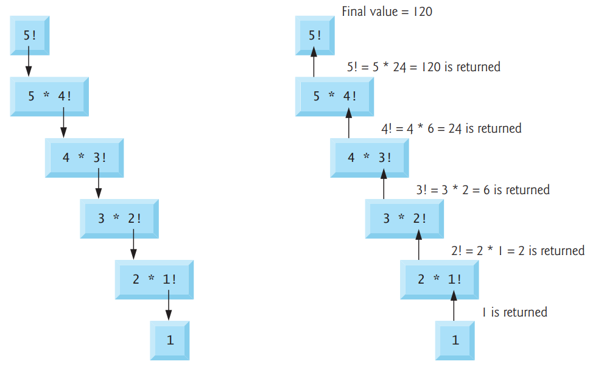

# Lab 7

Continuando o que vimos no roteiro anterior, aprofundaremos nossos conhecimentos para formular soluções elegantes utilizando funções com a linguagem C.

## Revisando o uso de funções

Usamos funções para modularizar programas combinando as novas funções que você escreve com funções de bibliotecas padrão de C, como, por exemplo, a biblioteca padrão `stdio.h`, com funções para tratar entrada e saída de dados.

Note que, na linguagem C, além de definirmos uma função, modularizando a sua solução com o uso ou não de parâmetros, como estamos acostumados em linguagens mais simples, definimos um `prototype`, ou seja, uma espécie de "esqueleto" preparando o compilador para entender como será a nossa função. 

Para relembrarmos esses conceitos, veja o exemplo de uma função para definir o maior dentre 3 números:

```
#include <stdio.h>

int maximo(int x, int y, int z);

int main(void) 
{
  int n1 = 0, n2 = 0, n3 = 0;
  printf("%s", "Digite três números inteiros: ");
  scanf("%d%d%d", &n1, &n2, &n3);
  
  printf("Maximum is: %d\n", maximum(n1, n2, n3));
  return 0;
}

int maximo(int x, int y, int z) 
{
  int max = x;
  
  if (y > max) 
    max = y; 
  if (z > max) 
    max = z; 
    
  return max;
}
```

**Exercício 1**: Escreva uma função para verificar se um ano é bissexto ou não. Utilize a seguinte regra: um ano bissexto é divisível por 4, mas não por 100, ou então é divisível por 400.
Exemplo: 1988 é bissexto pois é divisível por 4 e não é por 100; 2000 é bissexto porque é divisível por 400.

**Desafio 1**: Construa uma função que recebe um número inteiro como parâmetro e retorna 1 se ele for primo e 0 caso não seja. Dica: Para avaliar se um número é primo, utilize o Crivo de Erastóstenes.

## Recursividade

Recursividade ou recursão é o uso de uma função que chama a si mesma. Sim, isto é possível, uma função pode invocar a si mesma!
Mas, como funciona a recursividade?


Em uma função recursiva, a cada chamada é criada na memória uma nova ocorrência da função com comandos e variáveis “isolados” das ocorrências anteriores.
A função é executada até que todas as ocorrências tenham sido resolvidas. _Em outras palavras, seria como dizer: para resolver um problema, eu recorro a mim mesmo para resolver da mesma forma o problema um pouco menor, e, para esse problema um pouco menor, faço o mesmo..._

Porém um problema que surge ao usar a recursividade é _como fazê-la parar_. Caso o programador não tenha cuidado é fácil cair num loop infinito recursivo o qual pode inclusive esgotar a memória…

Toda recursividade é composta por um **caso base** e pelas **chamadas recursivas**. O caso base é o caso mais simples. É usada uma condição em que se resolve o problema com facilidade. As chamadas Recursivas, por sua vez, procuram simplificar o problema de tal forma que convergem para o caso base.

### Vantagens da recursividade

Torna a escrita do código mais simples e elegante, tornando-o fácil de entender e de manter.

### Desvantagens da recursividade

Quando o loop recursivo é muito grande é consumida muita memória nas chamadas a diversos níveis de recursão, pois cada chamada recursiva aloca memória para os parâmetros, variáveis locais e de controle. Por essa razão, em muitos casos, uma solução iterativa (utilizando laços) é indicada, pois gasta menos memória, e torna-se mais eficiente em termos de performance do que usar recursão.

Para entender melhor, vamos recorrer ao exemplo mais famoso de recursividade, o cálculo de fatorial.

## Exemplo de Recursividade: Fatorial

O cálculo de um número fatorial, representado pelo sinal de exclamação `!`, se dá com a multiplicação sucessiva de seus antecessores até chegar no número 1. Por exemplo, para calcular o fatorial de 5, temos: 5! = 5\*4\*3\*2\*1 = 120.

Para expressar essa solução usando uma abordagem iterativa, nós teríamos o seguinte: 

```
//Cálculo de fatorial com função iterativa
#include <stdio.h>

//protótipo da função fatorial
double fatorial(int n);

int main(void)
{
  int numero;
  double f;
  
  printf("Digite o numero que deseja calcular o fatorial: ");
  scanf("%d",&numero);
  
  //chamada da função fatorial
  f = fatorial(numero);
  
  printf("Fatorial de %d = %.0lf",numero,f);
  
  return 0;
}

//Função iterativa que calcula o fatorial
//de um numero inteiro n
double fatorial(int n)
{
  double vfat = 1;
  for (; n >= 1; n--) {
    vfat *= n;
  }
  
  return vfat;
}
```

Note que, ao expressarmos a solução na linguagem natural, nós citamos as duas partes importantes de uma função recursiva: as chamadas recursivas (multiplicação sucessiva dos antecessores) e o caso base (chegar no número 1). Compreendendo isto, podemos modificar nossa solução iterativa para uma recursiva:

```
// Cálculo de fatorial com função recursiva
#include <stdio.h>

// Protótipo da função fatorial
double fatorial(int n);

int main(void)
{
  int numero;
  double f;
  
  printf("Digite o numero que deseja calcular o fatorial: ");
  scanf("%d",&numero);
  
  // Chamada da função fatorial
  f = fatorial(numero);
  
  printf("Fatorial de %d = %.0lf",numero,f);
  
  return 0;
}

// Função recursiva que calcula o fatorial de um numero inteiro n
double fatorial(int n)
{
  double vfat = 1;
  
  if ( n <= 1 ) // Caso base: fatorial de n <= 1 retorna 1
    return 1;
  else
  {
    // Chamada recursiva
    vfat = n * fatorial(n - 1);
    return vfat;
  }
}
```

A execução desse código, de forma ilustrada, pode ser compreendida pela figura a seguir: 



Note que o caso base se parece com a condição de parada de um laço, tendo a mesma função: impedir que o programa entre em loop infinito, estourando a memória. Logo, toda vez que tiver dificuldade de resolver uma função recursiva, uma alternativa é pensar na implementação iterativa. 

**Exercício 2**: Escreva uma função recursiva `imprimeCubos` que recebe um valor e imprime os cubos de 1 até este valor (inclusive). Por exemplo, ao receber o valor 3, serão impressos 1, 8 e 27.

**Exercício 3**: Amplie o código anterior com uma nova função recursiva chamada `imprimePotencias` para receber três parâmetros: você irá fornecer o valor limitante inicial, o valor limitante final e qual será o expoente (nesta ordem). Por exemplo, ao receber os números 2, 5 e 2, serão impressos 4, 9, 16 e 25.

**Desafio 2**: Escreva uma função recursiva que resolva o problema da sequência de Fibonacci. 
