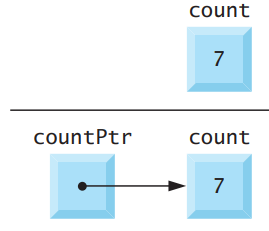

# Lab 9

## Ponteiros

Ponteiros são variáveis cujos valores são endereços de memória. Normalmente, uma variável contém diretamente um valor específico. Um ponteiro, no entanto, contém o endereço de outra variável que contém um valor específico. O ponteiro aponta para essa variável. Nesse sentido, um nome de variável referencia diretamente um valor e um ponteiro referencia indiretamente um valor, como na imagem a seguir:



Referenciar um valor por meio de um ponteiro é chamado de indireção.

### Declarando um Ponteiro

Ponteiros, como todas as variáveis, devem ser definidos antes de serem usados. A instrução a seguir define a variável `countPtr` como um `int *` — um ponteiro para um inteiro:

```
int *countPtr;
```

Esta definição é lida da direita para a esquerda: “countPtr é um ponteiro para int” ou “countPtr aponta para um objeto ou variável do tipo int”. O `*` indica que a variável é um ponteiro.

